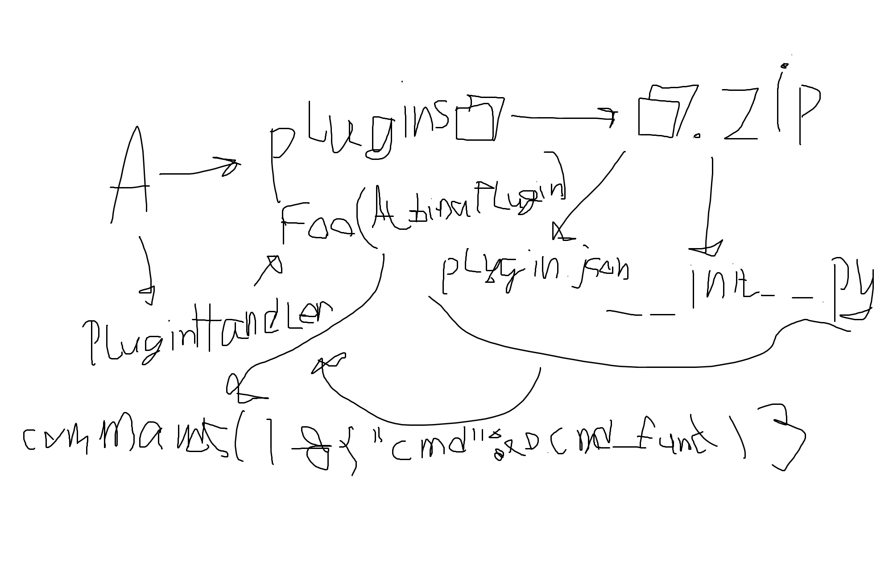

# Albina
EN:
ATTENTION! READ THIS GUIDE BEFORE STARTING THE GAME.
In this game, you play as a blind ancient Russian witch who navigates a labyrinth using the commands "up," "down," "left," and "right." You have a magic bag from which you can retrieve random items from the underworld using the "give" command. Items will be stored in your inventory. You can select an item using the "select" command by adding the number of the item you want. You can view all your items using the "inventory" command. Create new worlds with the "new" command and load them with the "load" command, using the index rather than the world name. You can either equip an item with the "set" command or use a special item with the "use" command. However, keep an eye on your hunger bar and replenish your energy with the "eat" command. Trying to eat non-food items will leave you unsatisfied and will cause you to lose the item. You can also kick the "kick" command, as all the mobs will simply die waiting for you. You can also ONLY kick the "kick" command. The top bar also displays important information such as coordinates, health, sleepiness, and hunger, the number of days you've been in the labyrinth, time spent in it, and experience. Your main goal is to escape the labyrinth (the exits are located at coordinates 50,000) and not die. If you've forgotten the name of this dreadful game, you can view it with the "credits" command. If you're tired, you'll slowly die until you sleep with the "sleep" command. You can also find Ping Pong to play with the "ping" command. You can also view information about what you're wearing with the "cloth" command. After reading the guide, we wish you a pleasant game and new fingers. And remember, no one will help you, not even the "help" command.

RU:
ВНИМАНИЕ ПЕРЕД НАЧАЛОМ ИГРЫ ОЗНАКОМЬТЕСЬ С ДАННЫМ РУКОВОДСТВОМ
В этой игре вы играете за слепую древнерусскую ведьму проходящую лабиринт командами "up", "down", "left", "right", у вас есть волшебный мешок откуда из приисподни вы можете доставать случайные придметы командой "give", предметы будут храниться в вашем инвентаре, вы можете выбрать предмет командой "select" добавив цифру нужного вам предмета, посмотреть все ваши предметы можно командой "inventory". Создавайте новые миры командой "new" и загружайте их командой "load" с индексом, а не названием мира, вы можете либо надеть придмет командой "set", а использовать специальный предмет командой "use", но следите за голодом в верхнем баре, подкрепляйтесь командой "eat", при попытке съесть не еду вы не насытитесь и лишитесь предмета, также вы можете пинать балду командой "kick" так как все мобы просто сдохли в ожидании вас, также вы можете пинать ТОЛЬКО балду командой "kick",также в верхнем баре вы можете обзовестись важной информацией такой как координаты, здоровье, сонливость и голод, день прибывания в лабиринте, время и опыт. Ваша главная цель - выбраться из лабиринта, выходы находятся на 50000 координатах и не умереть. Если вы забудите название этой ужасной игры то можете посмотреть её командой "credits", если вы устанете то будете медленно умирать пока не поспите командой "sleep", также вы можете найти ping pong чтобы сыграть в него используйте комнду "ping", вы также можете ознакомится с информацией о том что на вас надето командой "cloth". После ознакомления руководством мы желаем вам приятной игры и новых пальцев, и помните вам никто не поможет, даже команда "help".

Plugin ideas

## Json structure
#### server.alb
- seed: int
- layout
- items
- mods
- discovered
- time: float
#### stat.alb
- x: int
- y: int
- hp: int
- sleep: float
- hunger: float
- exp: int
- day: int
- time
- inventory
- equipped: {
  - hat 
  - jacket
  - pants
  - shoes
}
- used
- killed_mobs
- collected_items
- start_time: float
- inventory_capacity: int
- kick_damage: int
